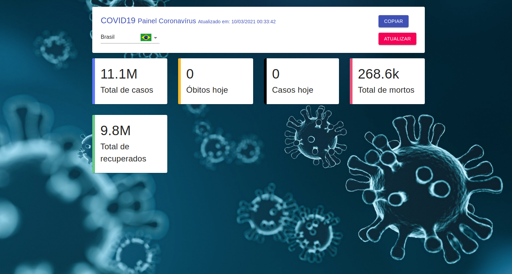

# Covid19 - DIO

## Sobre o projeto

Projeto desenvolvido no bootcamp da Digital Innovation One.

Objetivo do projeto foi criar uma aplicação que consumisse dados fornecidos por uma API e renderizar essas informações.

## Como rodar o projeto

Clone este repositório

`git clone https://github.com/vitorsemidio-dev/covid19-dio.git`

Instale as dependências

`npm install`

Inicie o projeto

`npm start`

## Imagem do projeto

